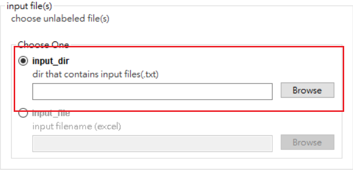
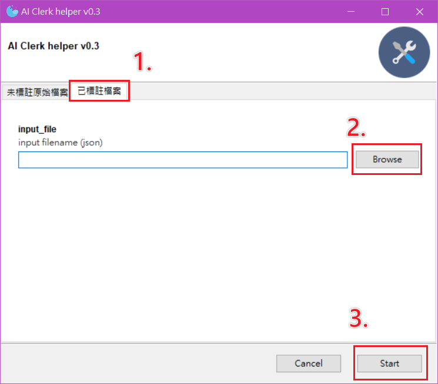

## changelog

### v0.8.6

1. exported title in json file use relative path

    

### v0.8.5

1. Set default selection to the first option, and move input dir that contains .txt to the first option.

    

2. Rename title to DataTag Helper (標註轉檔小幫手)


### v0.8.4

1. Move SqliteDict into main(), only when using GUI will call it. This is to avoid connecting to the sqlite when test CLI.

### v0.8.3

1. Rename to DataTag_helper

### v0.8.2

1. fix "Missing optional dependency 'xlrd'." error, jsut use openpyxl. see: https://github.com/pandas-dev/pandas/issues/38424

2. called monkey patch for gooey gui components only when before entering GUI mode (to avoid non-gui import generate "module not found" error)

### v0.8.1

second labeled json cleaner support input Multiple first labeled file


### v0.8.0

1. add second_upload function

    

2. add second labeled json cleaner and converter

    

### v0.7.2

1. add SerialID column in contents tab

    


### v0.7.1

1. fix numpy issue
2. remove xlrd
3. fix KeyError issue

### v0.7.0

- 新增批次處理txt檔功能

    

    注意：第一層的txt會自動忽略，只會加入第二層以下的txt

    

- 已標註資料轉換輸出之 excel檔新增多種視圖：

    a. 以標註者為單位，一次呈現多位標著者之選項及句子標註結果
    

    b. 以選項為單位，比較多位標註者之結果
    

    c. 以句子為單位，比較不同標註者結果
    

    d. 以句子編號為單位，比較不同標註者結果
    

    e. 將句子按類別及編號水平展開呈現
    

    f. 將句子按類別水平展開呈現
    

- 未標註 excel 檔轉換成json 時，輸出 TextID mapping

    原本的 TextID 是從 excel 中的 Content 全文計算md5 hash得到，
    但是因為excel中可能存在非法字元及表情符號，
    後來輸出的文章會經過移除非法字元及將表情符號轉成文字的處理，
    因此有可能無法還原成原始的全文，造成無法計算得到原始的TextID。
    所以另外計算一個TextID 是透過將全文移除非法字元及表情符號後再計算md5，
    並且輸出處理後的TextID 與原始TextID 的對應表，
    如此當文章同一篇文章經過處理後，因原始 TextID不同而對不上時，
    可透過 TextID mapping 比較處理後的TextID，
    應該就能對回同一篇文章。

    

### v0.6.1

- Symptom1: 修復 Windows 下合併檔案出現 openpyxl.utils.exceptions.IllegalCharacterError

    Rootcause: The previous generated excel file contains illegal character \_x0008\_, which is an OOXML escape character[1].

    Solution: remove these illegal characters before write to excel[2].

- Symptom2: 修復當 json 檔中有 \_xHHHH\_ 這類字串(以純文字形式出現)時，輸出的 excel 檔會自動轉換成 \_xHHHH\_ 的 unicode 字元(僅在 Windows 下發生，在 linux 下會將純文字的底線(underscore, _) 再跳脫一次，轉換成 \_x005F_x0008\_ [1] 儲存到 excel)

    Rootcause: maybe openpyxl bug?

    Solution: this is a workaround. when dataframe read from json file by read_json(), look for \_xHHHH\_ pattern in this dataframe, and unescape it[3] before write to excel.

- References

    [1]:[VTBString Class (DocumentFormat.OpenXml.VariantTypes) | Microsoft Docs](https://docs.microsoft.com/en-us/dotnet/api/documentformat.openxml.varianttypes.vtbstring?view=openxml-2.8.1)

    > [ISO/IEC 29500-1 1st Edition]
    >
    > **bstr (Basic String)**
    >
    > This element defines a binary basic string variant type, which can store any valid Unicode character. Unicode characters that cannot be directly represented in XML as defined by the XML 1.0 specification, shall be escaped using the Unicode numerical character representation escape character format \_xHHHH\_, where H represents a hexadecimal character in the character's value. [*Example*: The Unicode character 8 is not permitted in an XML 1.0 document, so it shall be escaped as \_x0008\_. *end example*] To store the literal form of an escape sequence, the initial underscore shall itself be escaped (i.e. stored as \_x005F\_). [*Example*: The string literal *\_x0008\_* would be stored as *\_x005F_x0008\_*. *end example*]
    >
    > The possible values for this element are defined by the W3C XML Schema *string* datatype.

    [2]:[(1条消息)openpyxl.utils.exceptions.IllegalCharacterError 错误原因分析及解决办法_村中少年的专栏-CSDN博客](https://blog.csdn.net/javajiawei/article/details/97147219)

    > 进入python命令行模式，输入如下：
    >
    > ```python
    > >>> import sys
    > >>> help('openpyxl')
    >
    > ```
    >
    > 可得openpyxl模块的路径如下`/usr/local/lib/python2.7/site-packages/openpyxl`，查看该目录下的cell子目录中的cell.py文件，定位到具体错误代码为：
    >
    > ```python
    > def check_string(self, value):
    >     """Check string coding, length, and line break character"""
    >     if value is None:
    >         return
    >     # convert to unicode string
    >     if not isinstance(value, unicode):
    >         value = unicode(value, self.encoding)
    >     value = unicode(value)
    >     # string must never be longer than 32,767 characters
    >     # truncate if necessary
    >     value = value[:32767]
    >     if next(ILLEGAL_CHARACTERS_RE.finditer(value), None):
    >         raise IllegalCharacterError
    >     return value
    >
    > ```
    >
    > 其中`ILLEGAL_CHARACTERS_RE`的定义在文件的开头，如下：
    >
    > ```python
    > ILLEGAL_CHARACTERS_RE = re.compile(r'[\000-\010]|[\013-\014]|[\016-\037]')
    >
    > ```
    >
    > 这里面的非法字符都是八进制，可以到对应的ASCII表中查看，的确都是不常见的不可显示字符，例如退格，响铃等，在此处被定义为excel中的非法字符。\
    > 解决上述错误有两种方法，如下：\
    > 1，既然检测到excel中存在`[\000-\010]|[\013-\014]|[\016-\037]`这些非法的字符，因此可以将字符串中的非法字符替换掉即可，在重新写入excel即可。如下：
    >
    > ```python
    > text= ILLEGAL_CHARACTERS_RE.sub(r'', text)
    > ```
    >

    [3]:[openpyxl.utils.escape — openpyxl 3.0.5 documentation](https://openpyxl.readthedocs.io/en/stable/_modules/openpyxl/utils/escape.html)

    > ```python
    > def unescape(value):
    >     r"""
    >     Convert escaped strings to ASCII: _x000a_ == \n
    >     """
    >
    >
    >     ESCAPED_REGEX = re.compile("_x([0-9A-Fa-f]{4})_")
    >
    >     def _sub(match):
    >         """
    >         Callback to unescape chars
    >         """
    >         return chr(int(match.group(1), 16))
    >
    >     if "_x" in value:
    >         value = ESCAPED_REGEX.sub(_sub, value)
    >
    >     return value
    > ```

### v0.6

- 新增合併檔案功能

    

### v0.5

- 新增 train/test 切割功能

    

    

### v0.4.1

- 修正當某個欄位漏標時，會產生error而停止輸出
    解法：將漏標的欄位填入nan，方便其他人使用輸出後的檔案做檢查

### v0.4

1. 新增原文欄位(移除tag 標籤)

    

2. 多選選項直接以文字格式用逗號分隔儲存在同一格中

    

3. 句子與其標註攤平成兩欄(Sent_Label, Sentence)，沒有句子標註的TextID 則此兩欄留空白

    

### v0.3

- 將已標註檔案json 檔下載回來後，轉換成excel檔

    轉換後的 excel 內容分三頁：第一頁是contents，包含作者，標題、內文、標註者等；第二頁是document label，也就是類別標註；第三頁是sentence label 句子標註，因為句子有很多類，每類數量不一，我是將之橫向展開成不同欄

    
