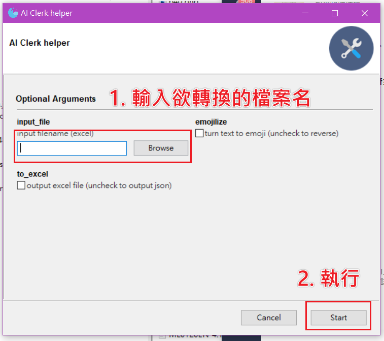

# AI Clerk Helper

[](https://open.vscode.dev/allenyllee/AI_Clerk_helper)

[](https://github.com/econchick/interrogate)

_________________

[Read Latest Documentation](https://allenyllee.github.io/AI_Clerk_helper/) - [Browse GitHub Code Repository](https://github.com/allenyllee/AI_Clerk_helper/)

_________________



## How to Build

### Method 1: Use Remote Container

#### Step 1: Clone into container

If you have installed [VSCode](https://code.visualstudio.com/) and [Docker](https://www.docker.com/get-started), just click [](https://open.vscode.dev/allenyllee/AI_Clerk_helper) and choose "Clone repo in container volume", it'll open a new container with building environments.

#### Step 2: Build

Building linux executable:
```
pyinstaller -F --windowed build-win.spec
```

Building Windows executable:
```
wine pyinstaller -F --windowed build-win.spec
```

#### Step 3: Generate API docs

Hosing in local
```
portray server
```

Push to github pages
```
portray on_github_pages
```


> We use [portary](https://github.com/timothycrosley/portray) to generate docs, and you can add [Pymdown Extensions](https://facelessuser.github.io/pymdown-extensions/) to extend Markdown format. For example, you can add `"pymdownx.arithmatex"` into `extra_markdown_extensions` list which under the section `[tool.portray]` of `pyproject.toml` to have the ability to parse LaTeX math equations.

#### Step 4: test pre-commit hook before commit

test for a file:
```
pre-commit run --files ./AI_Clerk_helper.py
```

test for all files:
```
pre-commit run --all-files
```

### Method 2: Manually Setup Environments

### Step 1: Install Anaconda

https://www.anaconda.com/products/individual


### Step 2: Install dependencies

Navigating to the directory of this repo.

```
cd /workspace/AI_Clerk_helper
```

Create conda env

```shell
conda create --name AI_Clerk_helper python=3.6

conda activate AI_Clerk_helper
```
> If conda install has permission error, excute:
>
> ```
> sudo chown 1000:1000 -R /opt/conda/
> ```
>
> This will change the owner of conda folder.

> If conda activation failed, just execute:
> ```
> conda init bash
> ```
> to init bash env

Install packages

```shell
conda install wxpython
conda install -c conda-forge gooey

pip install -r project_requirements.txt
pip install -r requirements.txt
```

> must first install wxpython before Gooey to avoid strange error
>
> [Installation via pip fails needing pathlib2 · Issue #474 · chriskiehl/Gooey](https://github.com/chriskiehl/Gooey/issues/474)


### Step 3: Execute

```shell
python AI_Clerk_helper.py
```

you should see the GUI window popup.

### Step 4: Install pyinstaller

[Gooey/Packaging-Gooey.md at master · chriskiehl/Gooey](https://github.com/chriskiehl/Gooey/blob/master/docs/packaging/Packaging-Gooey.md)

Packing Gooey into a standalone executable is super straight forward thanks to PyInstaller. It is the only dependency you'll need and can be installed via the following.

```shell
pip install pyinstaller==3.5
```

### Step 5: Building linux excutable with .spec file

From the command line, run

```shell
pyinstaller -F --windowed build-win.spec
```

- `-F` tells PyInstaller to create a single bundled output file
- `--windowed` disables the terminal which would otherwise launch when you opened your app.

And that's it. Inside of the `dist/` directory, you'll find a beautiful stand-alone executable that you can distribute to your users.

> If you encounter an error:
>
> ```
> FileNotFoundError: [Errno 2] No such file or directory: 'objcopy': 'objcopy'
> ```
>
> you should install dependenies
>
> ```
> sudo apt update
> sudo apt install -y binutils libc6
> ```
> see: [FileNotFoundError: [Errno 2] No such file or directory: 'objcopy': 'objcopy' · Issue #3815 · pyinstaller/pyinstaller](https://github.com/pyinstaller/pyinstaller/issues/3815)


### Step 6: Install wine

1. add wine apt repository

    For [Ubuntu - WineHQ Wiki](https://wiki.winehq.org/Ubuntu):

    ```shell
    sudo dpkg --add-architecture i386

    wget -O - https://dl.winehq.org/wine-builds/winehq.key | sudo apt-key add -

    sudo add-apt-repository 'deb https://dl.winehq.org/wine-builds/ubuntu/ bionic main'
    ```

    > Install unmet dependence: `faudio` (only needed for unbuntu18.04, because higher version already has libfaudio0 in repository)
    >
    > ```shell
    > sudo add-apt-repository ppa:cybermax-dexter/sdl2-backport
    > sudo apt update
    > ```

    For [debian 10](https://computingforgeeks.com/how-to-install-wine-on-debian/):
    ```
    sudo dpkg --add-architecture i386

    wget -qO - https://dl.winehq.org/wine-builds/winehq.key | sudo apt-key add -

    sudo apt-add-repository https://dl.winehq.org/wine-builds/debian/

    wget -O- -q https://download.opensuse.org/repositories/Emulators:/Wine:/Debian/Debian_10/Release.key | sudo apt-key add -

    echo "deb http://download.opensuse.org/repositories/Emulators:/Wine:/Debian/Debian_10 ./" | sudo tee /etc/apt/sources.list.d/wine-obs.list
    ```

    update:

    ```
    sudo apt update
    ```

    Notes:

    > check linux distribution:
    > ```
    > cat /etc/*-release
    > ```
    > see: https://www.cyberciti.biz/faq/find-linux-distribution-name-version-number/

    > If you encounter an error:
    >
    > ```
    > sudo: apt-add-repository: command not found
    > ```
    >
    > install
    >
    > ```
    > sudo apt -y install software-properties-common
    > ```


3. Install latest wine

    [How to Install Wine Devel 4.8 in Ubuntu 19.04 / 18.04 | UbuntuHandbook](http://ubuntuhandbook.org/index.php/2019/05/nstall-wine-4-8-ubuntu-19-04-18-04/)

    ```shell
    sudo apt install --install-recommends winehq-devel
    ```

4. install python in wine

    [python - compiling .py into windows AND mac executables on Ubuntu - Stack Overflow](https://stackoverflow.com/questions/17709813/compiling-py-into-windows-and-mac-executables-on-ubuntu)

    ```shell
    wine --version
    winecfg

    wget https://www.python.org/ftp/python/3.6.8/python-3.6.8-amd64.exe
    wine python-3.6.8-amd64.exe
    ```

    headless install:

    > install xvfb:
    > ```
    > sudo apt-get install --fix-missing -y xvfb
    > ```
    >
    > cerate virtual frame buffer:
    > ```
    > Xvfb :0 -screen 0 1024x768x16 &
    > ```
    >
    > execute python installer:
    > ```
    > DISPLAY=:0.0 wine python-3.6.8-amd64.exe /quiet InstallAllUsers=1 PrependPath=1
    > ```
    see: [xorg - Run wine totally headless - Super User](https://superuser.com/questions/902175/run-wine-totally-headless)


5. install wxpython, gooey, pyinstaller and other requirements

    ```shell
    wine pip install wxpython
    wine pip install gooey
    wine pip install -r project_requirements.txt
    wine pip install pyinstaller==3.5
    ```

6. activate upx compression (optional):

    [Releases · upx/upx](https://github.com/upx/upx/releases)

    ```shell
    wget https://github.com/upx/upx/releases/download/v3.96/upx-3.96-win64.zip
    unzip -j "upx-3.96-win64.zip" "upx-3.96-win64/upx.exe" -d "./"
    ```

    note: upx may cause dll corruption, you may want to disable UPX, see:

    - [Onefile builds not working on Windows 10, Error loading Python dll · Issue #3600 · pyinstaller/pyinstaller](https://github.com/pyinstaller/pyinstaller/issues/3600)
    - [python - Error when creating executable file with pyinstaller - Stack Overflow](https://stackoverflow.com/questions/38811966/error-when-creating-executable-file-with-pyinstaller)
    - [python - DLL load failure with Python3 (32bit)+PyInstaller+UPX (32bit) under Windows 10 (64bit) - Stack Overflow](https://stackoverflow.com/questions/59034735/dll-load-failure-with-python3-32bitpyinstallerupx-32bit-under-windows-10)
    - [Dependency Walker (depends.exe) Home Page](https://www.dependencywalker.com/)

### Step 7: Building Windows Executable from Linux

```shell
wine pyinstaller -F --windowed build-win.spec
```

debug mode

[Using PyInstaller — PyInstaller 3.6 documentation](https://pyinstaller.readthedocs.io/en/stable/usage.html#how-to-generate)

```shell
wine pyinstaller -F --windowed build-win.spec -d bootloader
```

### Step 8: Running Windows Executable through wine

```shell
wine ./dist/AI_Clerk_helper.exe
```

## Run test

Run test

```sh
pytest
```

Run test with print messages

```sh
pytest -s
```

How to test with cli? see: [Build and Test a Command Line Interface with Poetry, Python's argparse, and pytest - DEV Community 👩‍💻👨‍💻](https://dev.to/bowmanjd/build-and-test-a-command-line-interface-with-poetry-python-s-argparse-and-pytest-4gab)

## References

### Gooey

- [chriskiehl/Gooey: Turn (almost) any Python command line program into a full GUI application with one line](https://github.com/chriskiehl/Gooey)

### Gooey Options

- [Gooey/Gooey-Options.md at master · chriskiehl/Gooey](https://github.com/chriskiehl/Gooey/blob/master/docs/Gooey-Options.md)

### examples

- [chriskiehl/GooeyExamples: Example programs to Demonstrate Gooey's functionality](https://github.com/chriskiehl/GooeyExamples)

### mutually_exclusive_group

- [Gooey/all_widgets_subparser.py at 66f154decb8cd7d140a702277d8c262c4d8194cc · chriskiehl/Gooey](https://github.com/chriskiehl/Gooey/blob/66f154decb8cd7d140a702277d8c262c4d8194cc/gooey/tests/integration/programs/all_widgets_subparser.py#L75-L80)

- [python - How to define a mutually exclusive group of two positional arguments? - Stack Overflow](https://stackoverflow.com/questions/15530117/how-to-define-a-mutually-exclusive-group-of-two-positional-arguments)

- [Python argparse mutual exclusive group - Stack Overflow](https://stackoverflow.com/questions/17909294/python-argparse-mutual-exclusive-group)

### widget example

FileChooser, DirChooser, FileSaver, MultiFileChooser, DateChooser, TimeChooser

- [GooeyExamples/widget_demo.py at d0606a8d543babe1cff5db215d4d37e26888b490 · chriskiehl/GooeyExamples](https://github.com/chriskiehl/GooeyExamples/blob/d0606a8d543babe1cff5db215d4d37e26888b490/examples/widget_demo.py#L39-L54)

### dynamic update

- [GooeyExamples/dynamic_updates.py at master · chriskiehl/GooeyExamples](https://github.com/chriskiehl/GooeyExamples/blob/master/examples/dynamic_updates.py)
